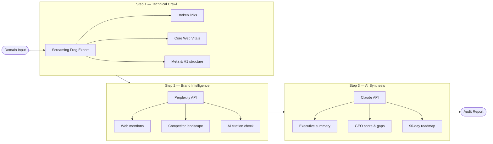

# BrandScope — AI Brand & Web Audit Tool


> Multi-source audit pipeline combining technical SEO, brand intelligence, and Generative Engine Optimization (GEO) — delivering structured reports in under 2 hours.

---

## What is GEO?

**Generative Engine Optimization** = making a brand visible to AI assistants (Claude, ChatGPT, Gemini) when they answer user queries.

When a decision-maker asks *"Who are the best branding agencies in Lyon?"* — if your client isn't cited, they're invisible to a growing segment of buyers.

BrandScope treats GEO as a **first-class audit dimension** alongside technical SEO.

---

## Pipeline


---

## GEO Checker
```python
import anthropic

client = anthropic.Anthropic()

def check_geo_visibility(brand_name: str, sector: str, city: str) -> dict:
    queries = [
        f"Quelles sont les meilleures agences de {sector} à {city} ?",
        f"Qui recommandes-tu pour du {sector} en France ?",
        f"Quels experts en {sector} contacter pour une PME ?",
    ]
    results = {}
    cited_count = 0
    for query in queries:
        message = client.messages.create(
            model="claude-sonnet-4-20250514",
            max_tokens=600,
            messages=[{"role": "user", "content": query}]
        )
        response = message.content[0].text
        cited = brand_name.lower() in response.lower()
        if cited:
            cited_count += 1
        results[query] = {"cited": cited, "excerpt": response[:200]}

    return {
        "brand": brand_name,
        "geo_score": round(cited_count / len(queries) * 100),
        "results": results
    }

if __name__ == "__main__":
    result = check_geo_visibility("Melbourne Agency", "branding", "Lyon")
    print(f"GEO Score: {result['geo_score']}/100")
```

---

## Audit Dimensions

| Dimension | Weight | What it measures |
|---|---|---|
| Technical Health | 25% | Speed, crawlability, structure |
| SEO On-Page | 20% | Content, metadata, internal links |
| Brand Presence | 20% | Mentions, PR, backlinks |
| **GEO / AI Visibility** | **25%** | AI citation rate, entity clarity |
| Reputation | 10% | Reviews, social proof |

---

## Setup
```bash
git clone https://github.com/HacklynDL/brandscope-audit
cd brandscope-audit
pip install anthropic requests python-dotenv
export ANTHROPIC_API_KEY=sk-ant-...
python scripts/geo_checker.py
```

---

*Built by [Didier Lioniello](https://linkedin.com/in/didierlioniello) — Applied AI Architect · 2025–2026*
